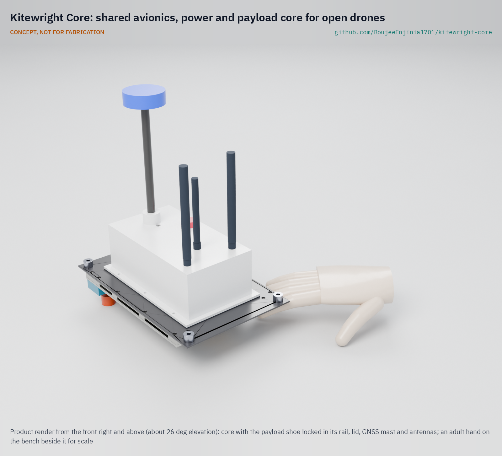
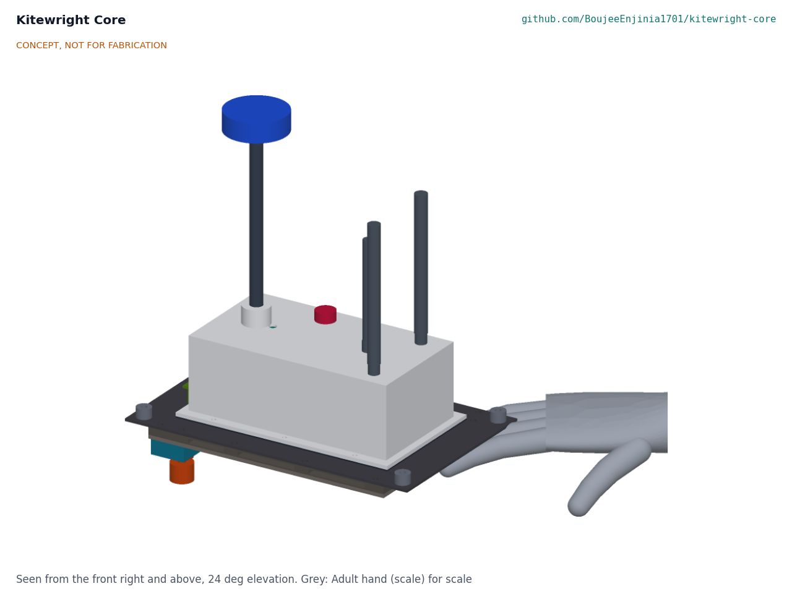
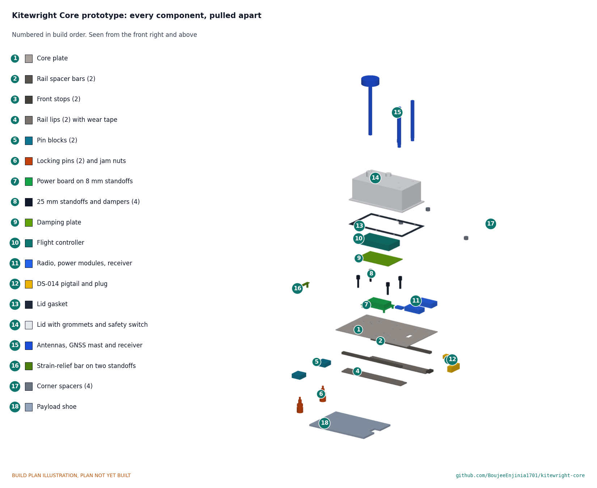

# Kitewright Core

   

**Area:** Aerial robotics · **TRL:** 3 of 9 (proof of concept on paper) · **Value-engineering target:** USD 5,000; estimated cost USD 3,946.80 · **Difficulty:** 4 of 5

The shared core of the Kitewright open drone family: open autopilot, ColdCell power bus and one standard payload mount.

## Concept rationale

Kitewright is an open civilian drone family built so that one set of avionics, one power bus and one payload mount serve every frame and every payload. Kitewright Core is that shared part: an autopilot running PX4 (ArduPilot as an alternative), a ColdCell power bus, radio links, a ground station setup and a single payload mount that carries both power and data. The Lift multirotor and the Range quadplane bolt onto it, and payloads such as AvalancheScout and LakeWatch plug into it. A fix or a tuning result found on one frame reaches all of them.

The core is tuned for the conditions that sparked the family: high, cold mountains such as Kashmir and the Himalaya, where Amish Chadha wants to fly. Our own first estimate is that at 5,000 m and -20 °C a multirotor hovers for only about 47% of its sea-level time (estimate, combining thinner air with cold battery capacity; to be checked on AltiRig). The core therefore treats cold power, altitude tuning and conservative failsafes as design inputs, not afterthoughts. The payload mount follows the open Pixhawk Payload Bus standard, DS-014, with a plain rail and locking pin, so third-party payloads can follow a published interface.

## Burning platform

Drones already save lives: DJI counted more than 1,000 people rescued with drone help worldwide by July 2023 ([DJI, 2023](https://www.dji.com/media-center/announcements/dji-records-more-than-1000-people-rescued-by-drones-globally)). In the high mountains they also carry loads: in April 2024 an unmodified DJI FlyCart 30 carried 15 kg between Everest Base Camp and Camp 1, at 5,300 to 6,000 m and -15 to 5 °C, in a 12 minute round trip that takes Sherpas 6 to 8 hours on foot through the icefall ([DJI, 2024](https://www.dji.com/media-center/announcements/dji-completes-world-first-drone-delivery-tests-on-mount-everest-en)). India has 189 high-risk glacial lakes above 4,500 m that field teams can reach only from June to September ([ThePrint, 2024](https://theprint.in/india/govt-approves-rs-150-crore-for-glacial-lake-outburst-flood-risk-mitigation-programme-for-4-states/2232525/)).

The platforms that can work there are closed and costly. A DJI Matrice 350 RTK costs USD 14,814 and uses its own payload and battery system ([Advexure](https://advexure.com/products/dji-matrice-350-rtk)); its self-heating TB65 batteries cost USD 899 each and are used in pairs ([DroneFly](https://www.dronefly.com/products/dji-tb65-intelligent-flight-battery-m350)). Air at 5,000 m in the standard atmosphere has a density of 0.736 kg/m3, 60% of sea level, and a temperature of -17.5 °C ([Engineering ToolBox](https://www.engineeringtoolbox.com/standard-atmosphere-d_604.html)). Open parts exist, such as PX4, licensed BSD 3-Clause ([PX4 on GitHub](https://github.com/PX4/PX4-Autopilot)), and the Pixhawk Payload Bus standard ([Dronecode, 2021](https://dronecode.org/announcing-the-pixhawk-payload-bus-open-standard/)), but no open core combines them into a documented, cold-rated base that a whole family of frames and payloads can share.

## Where it could be used

### By industry

| Industry | Use |
| --- | --- |
| Mountain and wilderness search and rescue | Search, thermal and transceiver payloads on a shared core that works at altitude |
| Disaster response and civil protection | Survey, line drop and supply delivery after floods and landslides |
| Glaciology, hydrology and climate research | Glacial lake and snowpack survey payloads (LakeWatch) on an open, inspectable platform |
| Mountain infrastructure (hydropower, roads, utilities) | Inspection and monitoring in high valleys |
| Universities and makerspaces | A documented reference core for teaching and payload development |

### By country or region

| Country or region | Why it matters there |
| --- | --- |
| India (Kashmir Himalaya) | A 2026 inventory found 155 glacial lakes, five with very high outburst susceptibility that threaten several thousand buildings, 15 major bridges and a hydropower project ([Journal of Glaciology, 2026](https://www.cambridge.org/core/journals/journal-of-glaciology/article/glacial-lake-outburst-flood-susceptibility-and-potential-downstream-implications-across-the-kashmir-himalaya/501837D9ABC0A452DD68841F1225D78D)). |
| India (Himalayan states) | The national programme covers 189 high-risk lakes above 4,500 m, reachable on foot only from June to September ([ThePrint, 2024](https://theprint.in/india/govt-approves-rs-150-crore-for-glacial-lake-outburst-flood-risk-mitigation-programme-for-4-states/2232525/)); India's Drone Rules 2021 set the categories and Digital Sky process a civilian drone must follow ([PIB](https://static.pib.gov.in/writereaddata/specificdocs/documents/2022/jan/doc202212810701.pdf)). |
| Pakistan (Karakoram) | A small drone found Rick Allen alive on Broad Peak after 36 hours in 2018 ([Explorersweb, 2018](https://explorersweb.com/rick-allen-found-alive-on-broad-peak/)). |
| Nepal | Drone deliveries on Everest were tested at 5,300 to 6,000 m in 2024 and contracted by the government from May 2024 ([DJI, 2024](https://www.dji.com/media-center/announcements/dji-completes-world-first-drone-delivery-tests-on-mount-everest-en)). |
| United States | An average of 27 people a year have died in avalanches over the past decade ([CAIC](https://avalanche.state.co.us/accidents/statistics-and-reporting)); civilian drones there fly under FAA Part 107 ([FAA](https://www.faa.gov/uas/media/Part_107_Summary.pdf)). |

## What sparked the idea

In July 2018 the climber Rick Allen went missing high on Broad Peak in the Karakoram after a fall while descending. After 36 hours, Bartek Bargiel, who was filming a ski descent of K2, flew a small drone over the slope, spotted Allen alive at about 7,500 m and guided climbers to him ([Explorersweb, 2018](https://explorersweb.com/rick-allen-found-alive-on-broad-peak/)). The drone was a DJI Mavic Pro, flown far above its rated ceiling ([DroneDJ, 2018](https://dronedj.com/2018/07/16/mountaineer-rick-allen-was-feared-dead-on-broad-peak-but-a-dji-mavic-pro-drone-found-him-alive/)). Kitewright starts from that flight: an open family of drones, sharing one core, built for the mountains where it happened.

## Problem

Mountain and disaster teams who want drones for search, survey and delivery must buy closed platforms whose batteries, mounts and payloads work only with one maker. There is no open, documented core that a frame and its payloads can share, and that is set up for thin, cold air.

Full problem statement: [docs/01-problem.md](docs/01-problem.md)

## Concept

The shared core of Kitewright, an open drone family: an open autopilot on PX4, a ColdCell power bus, one standard payload mount carrying power and data (Pixhawk DS-014 with a plain rail and locking pin), radio and ground station, used by the Lift and Range frames and every payload.

Full design precis: [docs/02-concept.md](docs/02-concept.md) · Requirements: [docs/03-requirements.md](docs/03-requirements.md) · Calculations: [docs/04-calcs/01-sizing.md](docs/04-calcs/01-sizing.md) · Prototype build plan: [docs/05-build-plan.md](docs/05-build-plan.md) · Design decisions: [docs/06-design-decisions.md](docs/06-design-decisions.md) · General arrangement: [cad/drawings/KWC-DWG-001.pdf](cad/drawings/KWC-DWG-001.pdf)

At TRL 3 the core meets all eleven requirements on paper: the rail and two locking pins carry a 5 kg payload with factors of 8 or more, a gloved payload swap takes about 52 s, 100 W reaches the payload, and the avionics stay within their ratings from -20 to +45 °C. With a carbon fibre plate, lightened rails and the power leads moved into each frame's harness (Amish's decision of 2026-10-03), the core is estimated at 0.99 kg against R9's 1.0 kg. R8 is restated so that a core moving between Lift and Range has its frame's power harness resoldered at the bench (Amish's decision of 2026-10-04), and the frames now carry the core to one shared mounting envelope. The hover-time model gives 47 % of sea-level hover time at 5,000 m and -20 °C with cold packs and 70 % with ColdCell packs (estimates).

## Key components

- Flight controller (Pixhawk standard)
- GNSS receiver and compass
- ColdCell power bus and power distribution board
- Payload mount (plain rail, locking pin, DS-014 connector)
- Telemetry radio and control link
- Ground station kit
- Optional companion computer
- Cold-rated harness and avionics enclosure
- Altitude parameter sets

## Building the prototype

The prototype is one core: a 2 mm carbon fibre plate carrying the avionics under a printed lid, with a plain rail, two front stops and two spring locking pins underneath, and one payload shoe. Nine parts are made, the carbon plate by a cutting service and the others with a saw, drill, small mill, tap and 3D printer; everything else is bought, and each frame brings its own power leads. The [prototype build plan](docs/05-build-plan.md) gives a making sketch for every made part, close-ups of every joint, eleven assembly steps with pictures, first checks and safety stops. It is a plan, not yet built.

## Safety

> Published as an open engineering reference, not certified aviation equipment.
>
> Civilian use only. No weapons, targeting or military payloads, and none will be accepted into the family.
>
> Certification and operating approvals (FAA Part 107 in the United States, EASA rules in Europe, India's DGCA Drone Rules 2021) are out of scope at this TRL and will be addressed if prototypes progress. Builders must fly only where local rules allow.
>
> Propellers can cause serious injury: arm only in a clear area, and write pre-flight, arming and keep-out procedures before any powered test.
>
> Lithium battery packs can catch fire after a crash, over-charge or cold charging; follow ColdCell safety rules. The core carries up to 60 V and 200 A peak: power it first from a current-limited bench supply, and connect packs only through the keyed anti-spark connectors.
>
> Loss of link or power in thin air can mean a crash in remote terrain: return-to-launch, low-battery and geofence failsafes must be set and tested at each altitude band.
>
> Payloads must be locked and pin-checked before flight; a released payload is a falling object. Two independent locking pins are fitted; neither may show its red band, and the payload is tugged, before every flight.
>
> This design is published as an open engineering reference. It is a TRL 3 concept, not for fabrication, and not certified equipment.

## Repository layout

| Folder | Contents |
| --- | --- |
| `docs/` | Problem, concept, requirements, calculations and design decisions |
| `cad/src/` | build123d Python source, the source of truth for all geometry |
| `cad/step/`, `cad/stl/` | Exported models for FreeCAD, other CAD tools and printing |
| `cad/drawings/` | 2D sketches and dimensioned drawings |
| `bom/` | Bill of materials |
| `electronics/` | KiCad schematics and PCB layouts |
| `firmware/` | Microcontroller code |
| `media/` | Renders, perspectives and photos |
| `build-log/` | Dated prototyping notes |

## Documentation

Controlled documents follow the portfolio [documentation standard](.kit/STANDARDS.md). Each carries a document ID (KWC-PRC-001 for the precis), a version and a revision history. Branded PDFs are built with `python .kit/render.py` and attached to GitHub Releases when a document is tagged, for example `KWC-PRC-001/v1.0`.

## Credits

Designed by Amish Chadha at Design Molecule Labs. See [CONTRIBUTORS.md](CONTRIBUTORS.md) for roles. To cite this design, use [CITATION.cff](CITATION.cff) (GitHub shows it as "Cite this repository").

AI assistance (Claude) was used to accelerate prototype documentation and first-pass research. Design direction and all decisions are Amish Chadha's, recorded in this repository's decision records (`docs/decisions/`).

## Licenses

- **Hardware** (CAD, drawings, BOM, electronics): [CERN-OHL-S v2](LICENSE)
- **Software** (firmware, scripts, notebooks): [MIT](LICENSE-SOFTWARE)

A project of the [Design Molecule](https://designmolecule.com) lab.
