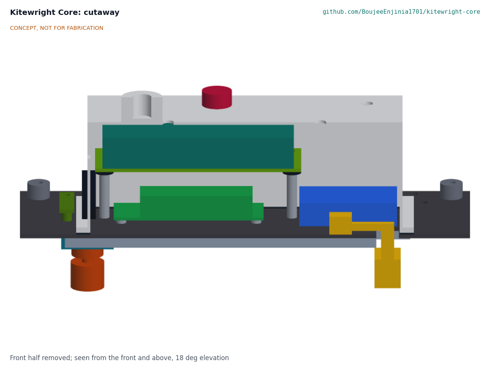
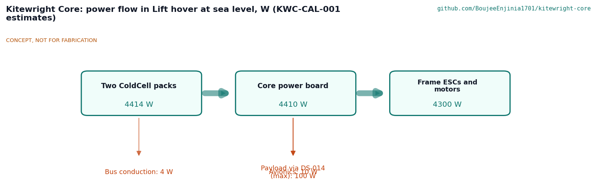
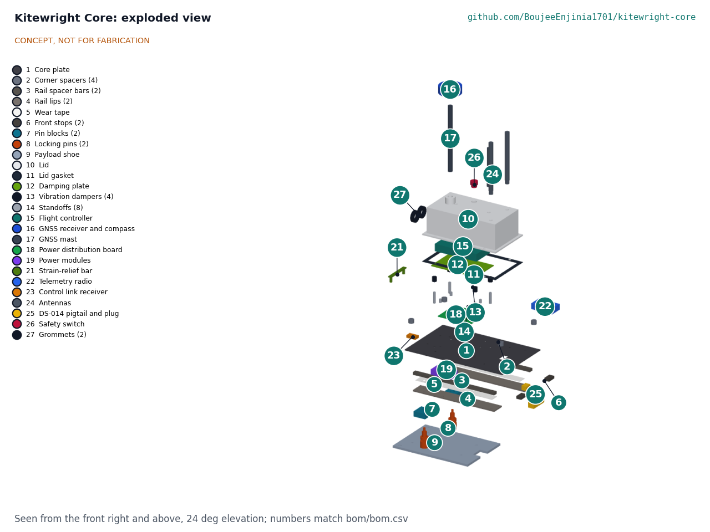

# Kitewright Core design precis

The shared core of the Kitewright open drone family: open autopilot, ColdCell power bus and one standard payload mount.

## Summary

Kitewright Core is a 240 x 150 mm carbon fibre plate that hangs under a frame's deck on four M4 bolts. On top, under a printed lid that rises through an opening in the deck, sit a Pixhawk-standard flight controller on vibration dampers, a power distribution board for two ColdCell packs, two independent 5.3 V supplies, a payload power switch, a telemetry radio and a control link receiver. A GNSS receiver stands on a removable mast above the lid. Under the plate is the payload mount: a plain rail of aluminium bars in which a 5 mm payload shoe slides from the rear to two front stops and is held by two spring locking pins, with the DS-014 power and data plug on a short pigtail. The same core, unchanged, flies Kitewright Lift and Kitewright Range with published parameter sets for three altitude bands. On paper it meets all eleven requirements; its estimated mass is 0.99 kg against R9's 1.0 kg after Amish's decision 33B on 2026-10-03 (Figure 1, KWC-CAL-001).

*Figure 1. Kitewright Core, generated from the parametric model. CONCEPT, NOT FOR FABRICATION.*

## How it works

ColdCell packs plug into the two AS150 inputs of the frame's power harness, which Kitewright Lift or Range supplies and which enters the lid at the back (decision 33B). The power distribution board joins them, measures total current with a Hall sensor and feeds the frame's speed controllers through two AS150 outputs. Two independent supplies, a digital power monitor and a backup supply, each turn the 18 to 60 V bus into 5.3 V for the flight controller, so one failure does not drop the avionics. A payload switch, enabled by the flight controller, feeds the bus to the payload's battery pins through the DS-014 pigtail with an 8 A limit.

The flight controller runs released PX4 with Kitewright parameter sets. It reads the packs' temperature and charge over DroneCAN from ColdCell's battery management system, the GNSS and compass on the mast, and the barometer on its own board, and it talks to the ground station over a 900 MHz class telemetry radio and to the pilot's handset over a long-range control link.

A payload carries a 184 x 128 x 5 mm aluminium shoe on its top. The operator pulls and twists both locking pins to their rest, slides the shoe into the rail from the rear until it stops against the front stops, and twists the pins back: they snap up into the shoe's two holes. The DS-014 plug is then pushed into the payload's socket, and the flight controller recognises the payload over MAVLink. The shoe's edges run between the plate and the taped lips with a 0.3 mm gap, so the lips carry its weight; the pins and front stops hold it fore and aft.

*Figure 2. Cutaway, front half removed: the damped flight controller above the power board, and the rail and shoe below the plate.*

*Figure 3. Power flow in Kitewright Lift's hover at sea level (KWC-CAL-001 estimates).*

## Main components

*Table 1. Components, numbered as in `bom/bom.csv` and Figure 4.*

| # | Component | Role |
| --- | --- | --- |
| 1 | Core plate, 240 x 150 x 2 mm carbon fibre | Carries everything; bolts to the frame on a 220 x 130 mm pattern |
| 2 | Corner spacers (4), 16 x 8 mm | Hold the plate 8 mm under the frame deck |
| 3, 4, 5 | Rail spacer bars, lips and wear tape | The plain rail: 200 mm long, 19 mm lip overlap, 0.3 mm running gap |
| 6 | Front stops (2) | End of travel, where both pins line up with their holes |
| 7, 8 | Pin blocks and locking pins (2) | Two independent spring plungers; a red band shows a withdrawn pin |
| 9 | Payload shoe | Fitted to every payload; the core kit carries one |
| 10, 11 | Lid and gasket | Printed ASA cover with mast boss, antenna, switch and grommet holes |
| 12, 13, 14 | Damping plate, dampers, standoffs | Isolate the flight controller from vibration |
| 15 | Flight controller, FMUv6X class | Runs PX4; triple IMU with heater; 16 outputs; Ethernet and CAN |
| 16, 17 | GNSS receiver and compass, mast | Position and heading, 231 mm above the plate, clear of power wiring |
| 18, 19 | Power distribution board, power modules | Pack inputs, frame outputs, current sensing, two 5.3 V supplies, payload switch |
| 20 | Clinch nuts (14) | Flush threads under the plate where the shoe slides |
| 21 | Strain-relief bar | Holds the frame's four 8 AWG power leads behind the lid; the leads and AS150 plugs belong to each frame (decision 33B) |
| 22, 23, 24 | Telemetry radio, control link receiver, antennas | Command, telemetry and control path |
| 25 | DS-014 connector pair and pigtail | Power and data to the payload |
| 26 to 29 | Safety switch, grommets, harness, fasteners | Arming safety, cable entries, cold-rated wiring |
| 30 | Companion computer (optional) | Payload processing in its own box on the frame, over Ethernet |
| 31 to 34 | Handset, ground station tablet, ground antenna, field charger | Ground station kit |
| 35 | Spares kit | Field spares |

*Figure 4. Exploded view; numbers match `bom/bom.csv`.*

## Numbers from the TRL 3 calculations

*Table 2. Key figures (KWC-CAL-001).*

| Quantity | Value | Basis |
| --- | --- | --- |
| Rated payload | 5 kg; vertical design load 147 N | R3 |
| Lowest strength factor | 10.8 (plate edge as a beam between frame bolts) | CAL section A |
| Fore-aft load on one pin alone | 221 N; 11.2 MPa shear in a 5 mm pin | CAL section A |
| Payload swap with gloves | About 52 s, no tools | CAL section B |
| Payload current for 100 W | 5.6 A at 18 V (6S), 2.2 A at 44.8 V | CAL section C |
| Hottest part at 45 °C ambient | About 75 °C (parts rated 85 °C) | CAL section D |
| Air density at 5,000 m | 0.736 kg/m³, 60 % of sea level | CAL section E |
| Hover time at 5,000 m and -20 °C | 47 % of sea level with cold packs; 70 % with ColdCell | CAL section F |
| Flight controller outputs used | Lift 11, Range 10, of 16 | CAL section G |
| Core mass | About 0.99 kg (R9 met on paper, 10 g margin) | CAL section H |
| Cost | USD 3,946.80 with ground station and spares | CAL section I |

Value-engineering target: USD 5,000. Estimated cost of the constructable design: USD 3,946.80 (USD 1,053.20 under the target).

## Key design choices

All decided under Amish's 2026-10-03 pre-approval; each is argued in KWC-DDR-001 or KWC-DDR-002 and indexed in the design decisions register, KWC-DEC-001.

- **PX4 first, ArduPilot as the documented alternative** (D1), on a Pixhawk FMUv6X class controller (D2).
- **One bus, 18 to 60 V** (D3), so a 6S Range and a 12S or 16S Lift use the same board, supplies and switch.
- **One payload class for version 1: 5 kg and 100 W** (D4).
- **Plain rail, rear entry, front stops, pigtail plug** (D5); no bayonet and no blind-mating connector.
- **Two independent locking pins** (D6), the conservative safety choice; either holds the payload alone.
- **Core hangs under the frame deck** (D7) on a 220 x 130 mm M4 pattern; the lid rises through a 200 x 112 mm opening.
- **Companion computer outside the core** (D8), so its heat and mass stay with the frames that need it.
- **ColdCell reports over DroneCAN** (D9), which released PX4 reads without changes.

## Patent design-arounds

From the preliminary patent, trademark and prior-art screen (not legal advice), all kept in the constructable design:

- Payload mount uses the Pixhawk DS-014 connector with a plain rail and locking pins, no bayonet, to stay clear of DJI US 2021/0316882 (payload mounting platform, claims unread). DJI US9890900B2 (quick gimbal connector) is expired.
- ColdCell packs use an external film heater on standard cells with a BMS thermostat, not in-cell resistor sheets (EC Power US9882197B2, to 2036). The core only reads the packs.
- Any tether input to the power bus is a fixed-voltage supply with onboard DC-DC conversion, not adaptive tether voltage (Elistair US11059580B2, to 2037). The core's 18 to 60 V inputs take a fixed-voltage tether converter like a pack.
- Attorney claim reads before any sale: DJI 2021/0316882, US9882197, US11059580.

## Relationship to other lab projects

- ColdCell (heated battery packs; reports over DroneCAN on the core's bus)
- AltiRig (thin-air propeller and motor test chamber; supplies the hover-thrust data for Table 6 of KWC-CAL-001)
- Kitewright Lift and Kitewright Range (host frames; provide the deck pattern and opening of D7)
- AvalancheScout and LakeWatch (payloads; each carries a shoe of KWC-DWG-106 and a DS-014 socket)

## Safety

> **Safety:** Published as an open engineering reference, not certified aviation equipment. Civilian use only. No weapons, targeting or military payloads, and none will be accepted into the family.
>
> **Safety:** Certification and operating approvals (FAA Part 107 in the United States, EASA rules in Europe, India's DGCA Drone Rules 2021) are out of scope at this TRL and will be addressed if prototypes progress. Builders must fly only where local rules allow.
>
> **Safety:** Lithium packs: the core carries up to 60 V and 200 A peak from two packs. Connect packs only through the anti-spark AS150 connectors, check polarity on a current-limited bench supply first, never charge a pack below its charge temperature (ColdCell blocks this), and keep a lithium fire plan at hand. A crashed pack can catch fire hours later.
>
> **Safety:** Moving machinery: propellers on the frames can cause serious injury. The core's safety switch must be pressed before arming; arm only in a clear area, and write pre-flight, arming and keep-out procedures before any powered test.
>
> **Safety:** Falling payload: a released payload is a falling object. Two independent locking pins are fitted; both must show no red band, and the payload is tugged, before every flight. Nobody stands under a payload being lifted.
>
> **Safety:** Loss of link or power in thin air can mean a crash in remote terrain: return-to-launch, low-battery and geofence failsafes must be set and tested at each altitude band (KWC-CAL-001, Table 6).

This design is published as an open engineering reference. It is not certified equipment.

## Open questions

None for design. Facts that can only be settled with parts in hand (the DS-014 licence, pinout and pin rating, the controller's mounting pattern, plunger stroke) are listed under "To confirm when parts are bought" in KWC-DEC-001. R9 core mass awaits Amish's decision (`docs/REVIEW.md`).
